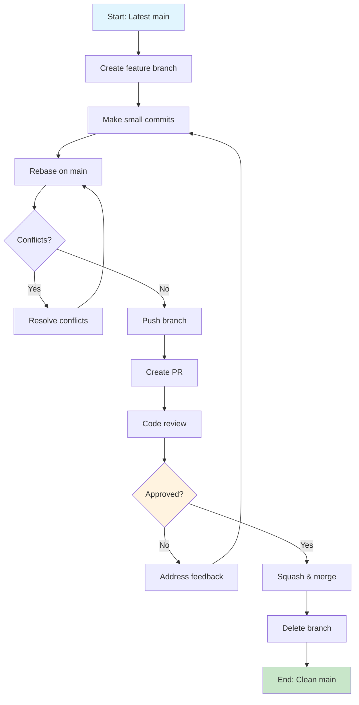

### Branching Strategy & Development Workflow

<CRITICAL_REQUIREMENT type="MANDATORY">
AI assistants MUST follow trunk-based development with lightweight, short-lived feature branches. All changes MUST go through pull request review process.
</CRITICAL_REQUIREMENT>

**Core Principles:**
- **Trunk-based Development**: Work directly from `main` branch with short-lived feature branches (max 2-3 days)
- **Small, Frequent Commits**: Make numerous small commits rather than large, infrequent ones
- **Continuous Integration**: Every branch should be integration-ready and tested
- **Pull Request Mandatory**: ALL changes, no matter how small, MUST go through PR process

**Workflow Requirements:**
1. **Branch Creation**: Create feature branches from latest `main`
2. **Development**: Make small, focused commits with clear messages
3. **Integration**: Regularly rebase/merge from `main` to stay current
4. **Review**: Submit PR when feature/fix is complete
5. **Approval**: Obtain at least one approval before merging
6. **Cleanup**: Delete feature branch after successful merge

<WORKFLOW_ENFORCEMENT>
- Branch lifetime: Maximum 3 days from creation to merge
- Commit frequency: Minimum 1 commit per day of active work
- PR size: Target ≤ 400 lines of code changes per PR
- Review requirement: At least 1 human reviewer approval required
 - Review turnaround: Initial review feedback target ≤ 1 business day for typical PRs
</WORKFLOW_ENFORCEMENT>

<!--
NAMING CONVENTIONS SUBSECTION
PURPOSE: Enforce consistent branch and PR naming across all AI interactions
WHAT: Mandatory naming patterns with specific type prefixes and formats
HOW: XML <NAMING_REQUIREMENTS> with pattern examples and counter-examples
REINFORCEMENT TECHNIQUES:
1. XML enforcement tags for machine parsing
2. Code block syntax highlighting for patterns
3. Visual checkmarks (✅/❌) for immediate pattern recognition
4. Concrete examples with explanations
5. Clear mapping between branch names and PR titles
DESIGN RATIONALE: Pattern recognition through visual cues and strict typing
-->

### Branch and Pull Request Naming Conventions

<NAMING_REQUIREMENTS type="MANDATORY">
AI assistants MUST use these exact naming patterns for branches and pull requests.
</NAMING_REQUIREMENTS>

**Branch Naming Pattern:**
```
<type>/<brief-description>
```

**Required Types:**
- `feature/` - New features or enhancements
- `fix/` - Bug fixes and hotfixes
- `docs/` - Documentation updates
- `refactor/` - Code refactoring without functional changes
- `test/` - Test additions or modifications
- `chore/` - Maintenance tasks (dependencies, build scripts)
 - `plan/` - Planning artifacts and proposals

**Examples:**
- ✅ `feature/add-user-authentication`
- ✅ `fix/resolve-login-timeout`
- ✅ `docs/update-api-documentation`
- ✅ `refactor/optimize-database-queries`
- ❌ `my-branch` (no type prefix)
- ❌ `feature/very-long-description-that-is-hard-to-read` (too verbose)

**Pull Request Naming:**
- PR titles MUST match branch name but use human-readable format
- Use imperative mood (same as commit messages)
- Examples:
  - Branch: `feature/add-user-authentication` → PR: "Add user authentication"
  - Branch: `fix/resolve-login-timeout` → PR: "Fix login timeout issue"

<!--
COMMIT MESSAGE CONVENTIONS SUBSECTION
PURPOSE: Standardize commit formatting for automated tooling and clarity
WHAT: Conventional commit specification with imperative mood requirements
HOW: XML <COMMIT_REQUIREMENTS> with format templates and validation rules
REINFORCEMENT TECHNIQUES:
1. Template-based format specification with placeholders
2. Imperative mood enforcement through bold text emphasis
3. Character limits for machine validation (50 char subject line)
4. Type categorization with semantic meaning
5. Multi-line examples showing complete commit structure
6. Negative examples with explicit rejection criteria
DESIGN RATIONALE: Structured format enables automation and consistent history
-->

### Commit Message Conventions

<COMMIT_REQUIREMENTS type="MANDATORY">
AI assistants MUST follow these commit message conventions for all commits.
</COMMIT_REQUIREMENTS>

**Format Requirements:**
```
<type>: <subject>

[optional body]

[optional footer]
```

**Subject Line Rules:**
- Use **imperative mood** ("Add feature" not "Added feature" or "Adds feature")
- Start with capital letter
- No period at the end
- Maximum 50 characters
- Be specific and descriptive

**Type Categories:**
- `feat:` - New features
- `fix:` - Bug fixes
- `docs:` - Documentation changes
- `style:` - Code style changes (formatting, semicolons, etc.)
- `refactor:` - Code refactoring without functionality changes
- `test:` - Adding or updating tests
- `chore:` - Maintenance tasks, dependency updates

**Examples:**
- ✅ `feat: Add user authentication with OAuth2`
- ✅ `fix: Resolve login timeout in production environment`
- ✅ `docs: Update API documentation for user endpoints`
- ✅ `refactor: Extract validation logic into utility functions`
- ❌ `Added new feature` (not imperative)
- ❌ `fix bug` (too vague)
- ❌ `Update stuff` (not descriptive)

**Body and Footer Guidelines:**
- Body: Explain **what** and **why**, not **how**
- Footer: Reference issues, breaking changes
- Example:
  ```
  feat: Add user authentication with OAuth2

  Implement OAuth2 authentication to replace legacy session-based auth.
  This improves security and enables SSO integration.

  Closes #123
  ```

<!--
BRANCH AND COMMIT PROCESS WORKFLOW SUBSECTION
PURPOSE: Define complete development lifecycle with visual process flow
WHAT: End-to-end workflow from branch creation to cleanup with decision points
HOW: XML <PROCESS_REQUIREMENTS> combined with Mermaid flowchart visualization
REINFORCEMENT TECHNIQUES:
1. Process requirement XML tags for mandatory compliance
2. Mermaid flowchart with conditional logic and decision points
3. Color-coded visual states (start=blue, end=green, decision=orange)
4. Sequential step numbering for pre-merge requirements
5. Bullet-point merge process rules for quick scanning
6. Visual and textual redundancy for dual-mode comprehension
DESIGN RATIONALE: Complex workflows need both textual rules and visual flow
-->

### Branch and Commit Process Workflow

<PROCESS_REQUIREMENTS type="MANDATORY">
AI assistants MUST follow this exact workflow for all code changes.
</PROCESS_REQUIREMENTS>

**Pre-Merge Requirements:**
1. **Rebase Strategy**: Always rebase feature branch on latest `main` before creating PR
2. **Commit Organization**: Squash related commits into logical units
3. **Testing**: Ensure all tests pass before requesting review
4. **Documentation**: Update relevant documentation as part of the same PR

**Merge Process:**
- **Squash and Merge**: Use squash merge for feature branches to maintain clean history
- **Linear History**: Maintain linear commit history on `main` branch
- **Branch Cleanup**: Delete feature branch immediately after successful merge
- **Rollback Ready**: Each merge to `main` should be easily revertible


