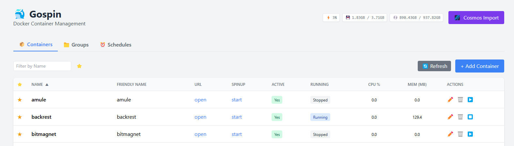
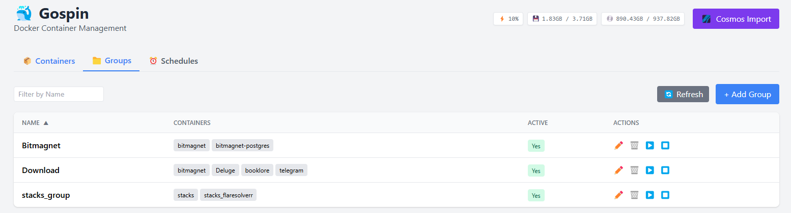
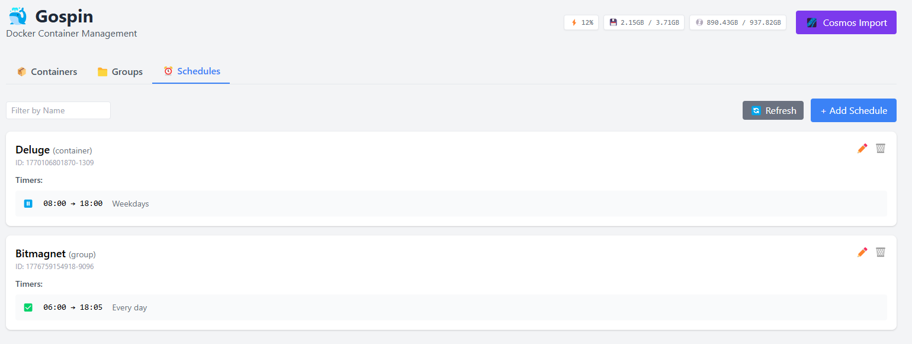
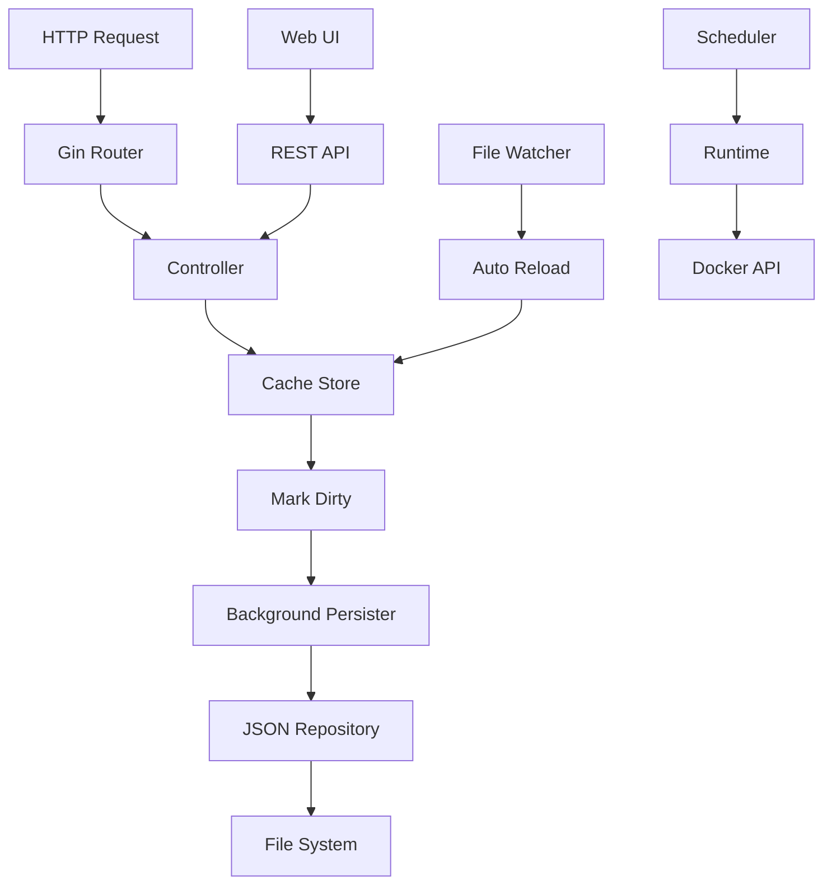

# 🐳 GoSpin

[](https://github.com/asgambat/gospin/actions/workflows/tests.yml) [](https://asgambat.github.io/gospin/)

**Scheduled Docker Container Management**

GoSpin is a Go application for scheduled management of Docker containers. Define containers, groups, and schedules with timers to automatically start/stop containers based on configured times and days.

Thanks to [spinnerr](https://github.com/drgshub/spinnerr) project for the inspiration and design patterns.
I have decided to rewrite the project in Go to leverage its performance, concurrency model, and strong ecosystem for Docker integration and to create a solution that could be easily integrated with my [Cosmos](https://github.com/azukaar/cosmos-server
) installation.

## ✨ Features

- **Container Management**: Register and manage Docker containers with friendly names and URLs
- **Groups**: Organize containers into logical groups for batch operations
- **Schedules**: Define time-based schedules with multiple timers per target
- **Automatic Start/Stop**: Containers are automatically started/stopped based on schedules
- **Web UI**: Modern SPA interface built with Alpine.js for visual management
- **REST API**: Full JSON API for programmatic access
- **File Watching**: Auto-reload configuration when the JSON file changes externally
- **Graceful Shutdown**: Proper cleanup on application termination

## Screenshots





## 🚀 Quick Start

### Prerequisites

- Go 1.25.6+
- Docker

### Installation

```bash
# Clone the repository
git clone https://github.com/asgambat/gospin.git
cd gospin

# Build (recommended — injects git tag/commit/build time into the binary)
make build            # → ./.build/main

# Or, manually with raw ldflags:
VERSION=$(git describe --tags --always --dirty 2>/dev/null || echo "0.0.9")
BUILD_TIME=$(date -u '+%Y-%m-%d_%H:%M:%S')
GIT_COMMIT=$(git rev-parse --short HEAD 2>/dev/null || echo "unknown")
GO_VERSION=$(go version | awk '{print $3}')
go build -ldflags "\
  -s -w \
  -X github.com/bassista/go_spin/internal/version.Version=$VERSION \
  -X github.com/bassista/go_spin/internal/version.BuildTime=$BUILD_TIME \
  -X github.com/bassista/go_spin/internal/version.GitCommit=$GIT_COMMIT \
  -X github.com/bassista/go_spin/internal/version.GoVersion=$GO_VERSION" \
  -o .build/main ./cmd/server/main.go

# Run
./.build/main
```

### Build-time version metadata

The version string rendered in the bottom-right of the dashboard is **not** read from `config/homepage.yaml`. It is injected into the binary at link time via `-ldflags "-X …/internal/version.<Var>=…"` and survives every release. Four `internal/version` package variables are populated this way:

| Variable | Source (Makefile default) | Example value |
|----------|---------------------------|---------------|
| `Version` | `git describe --tags --always --dirty` (fallback `0.0.9`) | `v1.2.3`, `v1.2.3-4-gabc1234`, `v1.2.3-dirty` |
| `BuildTime` | `date -u '+%Y-%m-%d_%H:%M:%S'` | `2026-06-22 14:30:00` |
| `GitCommit` | `git rev-parse --short HEAD` (fallback `unknown`) | `abc1234` |
| `GoVersion` | `go version \| awk '{print $3}'` | `go1.25.6` |

The same four `-X` flags are baked into `Dockerfile` via `--build-arg VERSION=… BUILD_TIME=… GIT_COMMIT=… GO_VERSION=…`, so multi-arch CI builds (`.github/workflows/docker_build_push.yml`) embed the same metadata into the published image. There is no environment variable that can override these at runtime — they are part of the compiled binary.

### Access

- **Web UI**: http://localhost:8084/ui
- **API**: http://localhost:8084/
- **Health Check**: http://localhost:8084/health

## ⚙️ Configuration

### Configuration File

Create `config/config.yaml`:

```yaml
server:
  port: 8084
  waiting_server_port: 8085
  shutdown_timeout_secs: 5
  read_timeout_secs: 10
  write_timeout_secs: 10
  idle_timeout_secs: 120

data:
  file_path: ./config/data/config.json
  persist_interval_secs: 5 #how often to persist data to file
  base_url: "http://localhost/"  # Base URL for container URL generation, supports $1 token
  spin_up_url: "http://localhost/"  # Base URL for container lazy startup URL generation supports $1 token

misc:
  scheduling_enabled: true       # Enable/disable automatic containers starting/stopping based on schedules
  scheduling_poll_interval_secs: 30
  cors_allowed_origins: "*"      # CORS origins, default "*"
  cosmos_base_url: ""            # Cosmos API base URL (e.g., "https://cosmos.example.com")
  cosmos_token: ""               # Cosmos API bearer token for authentication
```

### Environment Variables

All settings can be overridden via environment variables with prefix `GO_SPIN_`:

```bash
# Server port
PORT=8084
# Log level
GO_SPIN_MISC_LOG_LEVEL=debug
# CORS allowed origins
GO_SPIN_MISC_CORS_ALLOWED_ORIGINS=*
# Config path
GO_SPIN_CONFIG_PATH=./config
# Cosmos API base URL
GO_SPIN_MISC_COSMOS_BASE_URL=https://cosmos.example.com
# Cosmos API bearer token
GO_SPIN_MISC_COSMOS_TOKEN=your-token-here
```
### Base URL for Container Links

The `baseUrl` field is used by the Web UI to auto-generate container URLs when selecting a container name:
- If `baseUrl` is empty → `http://localhost/{name}`
- If `baseUrl` does not contain `$1` → `{baseUrl}/{name}` (removes double slashes)
- If `baseUrl` contains `$1` → replaces `$1` with the container name (e.g., `https://$1.my.domain.com` → `https://Deluge.my.domain.com`)

# Waiting server port
You can configure an auxiliary "waiting" HTTP server used by the `/runtime/:name/waiting` endpoint. This server serves only the waiting HTML page (spinner + redirect) endpoint while a container or group is being started in background.

```bash
# Port used by the waiting server (default 8085)
WAITING_SERVER_PORT=8085
```

## 🔒 Security

### CORS Configuration

⚠️ **Production Warning**: The default CORS setting (`*`) allows all origins. For production environments, specify exact origins:

```yaml
misc:
  cors_allowed_origins: "http://localhost:3000,https://your-domain.com"
```

### Docker Socket Security

GoSpin requires access to the Docker socket (`/var/run/docker.sock`). This grants significant privileges:

- **Development**: Use `runtime_type: memory` for testing without Docker access
- **Production**: Consider running in a restricted environment or using Docker-in-Docker
- **Container mode**: Mount Docker socket as read-only when possible
- **User Permissions**: Run GoSpin under a user with limited permissions and add it to the `docker` group. Provide userId and groupId as Environment Variables when running in Docker (UID and GID environment variables).

### File System Permissions

Ensure proper permissions for:
- Configuration directory: `config/` (read-write)
- Data file: `config/data/config.json` (read-write)

```bash
# Recommended permissions
chmod 750 config/
chmod 640 config/config.yaml
chmod 660 config/data/config.json
```

---

## 🖥️ Web UI

#### GET `/ui`
Single Page Application interface.

#### GET `/ui/assets/*`
Static assets (CSS, JS, images).

The web interface provides visual management for:

| Tab | Features |
|-----|----------|
| **Containers** | List, Add, Edit, Delete, Start/Stop |
| **Groups** | List, Add, Edit, Delete, Multi-select containers |
| **Schedules** | List, Add, Edit, Delete, Full timer editor with day selection |

Access the UI at `http://localhost:8084/ui`

### UI Features

- **Real-time Status**: Container running status updates automatically
- **Bulk Operations**: Select multiple containers for group operations
- **Schedule Visualization**: Visual day selector for timer configuration
- **URL Generation**: Auto-generates container URLs based on `base_url` configuration
- **Responsive Design**: Works on desktop and mobile devices
- **Error Handling**: User-friendly error messages for failed operations

## 🏠 Homepage Configuration

GoSpin ships with a personal dashboard page rendered by `ui/home.html`. Its content and appearance are driven by a separate YAML file, **`config/homepage.yaml`**, which defines three top-level sections:

- **`services`** — visual cards (name, URL, description, icon) grouped under headings
- **`bookmarks`** — short links with an optional 2-character abbreviation, grouped under headings
- **`settings`** — page-wide customization (theme, title, fonts, polling intervals)

A complete example with all three sections lives at `config/homepage.yaml` in the repository.

### `settings` reference

All `settings` fields are **optional**. If a field is omitted or left empty, the application falls back to the documented default. String-valued size fields accept any valid CSS length (e.g. `1.25rem`, `20px`, `1.1em`).

| Field | Type | Default | Description |
|-------|------|---------|-------------|
| `theme` | string | `auto` | One of `auto`, `tokyo-night`, `catppuccin-latte`, `nord`, `dracula`, `gruvbox`, `night-stars`. With `auto`, the page follows the OS `prefers-color-scheme`. The on-page theme selector overrides this and persists the choice in `localStorage`. |
| `title` | string | `Dashboard` | Plain-text title rendered as the page `<h1>`. |
| `title_font_size` | CSS size | `1.25rem` | Font-size of the title (e.g. `1.5rem`, `20px`, `1.1em`). Exposed at runtime as the CSS custom property `--title-font-size`. |
| `font_family` | CSS font stack | `Inter, system-ui, -apple-system, BlinkMacSystemFont, 'Segoe UI', Roboto, sans-serif` | Page-wide font family. |
| `font_size` | CSS size | `17px` | Document-wide base font size; drives Tailwind rem-derived scaling. |
| `polling_interval_seconds` | int | `10` | How often the page polls `/homepage` to detect external config-file changes (in seconds). |
| `stats_polling_interval_seconds` | int | `3` | How often the page polls `/runtime/system-stats` to refresh CPU/RAM/Disk in the footer. |

### Example

```yaml
settings:
  theme: catppuccin-latte
  title: My Dashboard
  title_font_size: "1.5rem"
  font_family: "Inter, system-ui, -apple-system, BlinkMacSystemFont, 'Segoe UI', Roboto, sans-serif"
  font_size: "19px"
  polling_interval_seconds: 10
  stats_polling_interval_seconds: 3
```

### Available themes

Six named themes are available, plus `auto` which delegates to one of the dark/light themes based on the OS `prefers-color-scheme`:

| Theme           | Description                                                                  | Background image    | Translucent cards |
|-----------------|------------------------------------------------------------------------------|---------------------|-------------------|
| `tokyo-night`   | Dark blue Tokyo Night palette.                                               | —                   | No                |
| `catppuccin-latte` | Light Catppuccin Latte palette.                                            | Yes (locally hosted) | Yes               |
| `nord`          | Cool Nord palette (arctic, muted).                                           | Yes (locally hosted) | Yes               |
| `dracula`       | Classic Dracula palette (purple accents).                                    | —                   | No                |
| `gruvbox`       | Warm Gruvbox retro palette.                                                  | —                   | No                |
| `night-stars`   | Dark Dracula-inspired palette with a starry-night background image and translucent cards. | Yes (locally hosted) | Yes               |

Themes with a background image render it through a themed `body.<theme>::before` pseudo-element (with a per-theme `filter` and `opacity`) layered between the page background and the content. Background images are stored locally under `ui/assets/themes/<theme>-bg.jpg` (where `<theme>` is one of `nord`, `catppuccin-latte`, or `night-stars`) and served by the static asset router at `/ui/assets/themes/...`; **no third-party requests are made at runtime**, so the dashboard works offline and in air-gapped environments.

### Local theme assets

The three "glassmorphism" themes (`nord`, `catppuccin-latte`, `night-stars`) each ship with their own background image. To avoid leaking visitor activity to a third-party CDN and to keep the dashboard working in air-gapped / privacy-strict environments, these images are bundled with the repository and served by the Go server itself — **no third-party image fetches happen on the homepage at runtime**.

- **Directory**: [`ui/assets/themes/`](ui/assets/themes/) holds the source JPEGs (progressive, 2560px wide, ≈ 80% quality):
  - `nord-bg.jpg` — 2560×1707, ≈ 723 KB
  - `catppuccin-latte-bg.jpg` — 2560×1945, ≈ 308 KB
  - `night-stars-bg.jpg` — 2560×1628, ≈ 738 KB
- **Routing**: the static route `r.Static("/ui/assets", "./ui/assets")` defined in [`internal/api/route/ui_route.go`](internal/api/route/ui_route.go) registers every file in `ui/assets/` at the URL prefix `/ui/assets/...`. The CSS in [`ui/home.html`](ui/home.html) therefore references absolute paths like `url('/ui/assets/themes/nord-bg.jpg')`; the Gin router serves the bytes directly off disk with no extra middleware.
- **Total payload**: ≈ 3.29 MB (3,286,933 B) across all 12 files (3 themes × 4 variants: 2560 px JPEG, 1280 px JPEG, 2560 px WebP, 1280 px WebP). The browser fetches only the variant it needs per theme switch (via `image-set()`); the service worker pre-caches all variants for offline use.
- **Replacing an image**: drop a new JPEG with the same filename into `ui/assets/themes/` and restart the server (or hot-reload if your deployment supports it). No CSS change required.

### Search modal

The dashboard also exposes a keyboard-driven search palette — a Spotlight/VS Code-style overlay that jumps directly to any service or bookmark without scrolling.

**Trigger keys** (only when focus is not in an `INPUT`, `TEXTAREA`, `SELECT`, or contenteditable element, and no `Ctrl` / `Cmd` / `Alt` modifier is held):

- **Press `Enter`** — opens the modal with an empty query; results appear as you type.
- **Press any single alphanumeric key** (`a`–`z`, `A`–`Z`, `0`–`9`) — opens the modal **and** seeds the query with that character; subsequent typing refines the filter.

**Inside the modal**:

- **Result list** shows up to **6 matches**, real-time filtered across every service and bookmark currently rendered. Matches are weighted by relevance (exact name > name prefix > name substring > abbreviation match > description match) and ties are broken alphabetically by name.
- **Each result** displays the service/bookmark icon (`` with an abbr/first-two-letter monogram fallback), the name, the description, and the source group label.
- **Keyboard shortcuts** (also rendered in the modal's hint footer):
  - `↑` / `↓` — move the selection up/down
  - `↵` (Enter) — open the highlighted result in a new tab and close the modal
  - `Esc` — close the modal without navigating; focus returns to the page so the next `Enter` re-opens it
  - `Tab` — native browser focus order (cycles input → results)
- **Mouse** — clicking a result activates it the same way `Enter` does; hovering a row updates the keyboard selection so the next `Enter` opens that row.

The modal's source of truth is the same `data.services` + `data.bookmarks` already loaded on the page; an in-memory index is rebuilt every time the homepage config is hot-reloaded, so newly added services show up in search without a manual refresh.

Accessibility: the modal uses `role="dialog"` + `aria-modal="true"` + `aria-label="Search services and bookmarks"`, and each result carries `role="option"` with `aria-selected` reflecting the keyboard position.

### Notes

- The file is **hot-reloaded**: when the content-hash on the `/homepage` response changes, the page re-fetches and re-applies all visuals (theme, fonts, layout) without a full reload.
- The **build metadata** rendered in the bottom-right of the page (e.g. `v1.2.3 · abc1234`) is **not** a YAML field. It is sourced from four `internal/version.*` package vars at build time and exposed as top-level JSON fields on the `/homepage` response (`version`, `buildTime`, `gitCommit`, `goVersion`).
  - `make build` injects them via `-ldflags` from `git describe`, `date`, `git rev-parse`, and `go version`.
  - The Dockerfile injects the same four flags via `--build-arg` so the published image carries the metadata.
  - Users cannot override them via `homepage.yaml` — the server value always wins (a test pins this invariant: even a YAML `version: …` key is silently ignored).

## 📡 API Endpoints

### Health
| Method | Endpoint | Description |
|--------|----------|-------------|
| GET | `/health` | Health check |

### Containers
| Method | Endpoint | Description |
|--------|----------|-------------|
| GET | `/containers` | List all containers |
| POST | `/containers/import` | Import containers from Cosmos API |
| POST | `/container` | Create/update container |
| DELETE | `/container/:name` | Delete container |

### Groups
| Method | Endpoint | Description |
|--------|----------|-------------|
| GET | `/groups` | List all groups |
| POST | `/group` | Create/update group |
| DELETE | `/group/:name` | Delete group |

### Schedules
| Method | Endpoint | Description |
|--------|----------|-------------|
| GET | `/schedules` | List all schedules |
| POST | `/schedule` | Create/update schedule |
| DELETE | `/schedule/:id` | Delete schedule |


### Runtime Control
| Method | Endpoint | Description |
|--------|----------|-------------|
| GET | `/runtime/:name/status` | Check if container is running |
| POST | `/runtime/:name/start` | Start container |
| POST | `/runtime/:name/stop` | Stop container |
| GET | `/runtime/:name/waiting` | Serve waiting HTML page for a container or group (starts if not running) |

### Configuration
| Method | Endpoint | Description |
|--------|----------|-------------|
| GET | `/configuration` | Get application configuration for frontend |


### API Examples

```bash
# Health check
curl http://localhost:8084/health

# List containers
curl http://localhost:8084/containers

# Add container
curl -X POST http://localhost:8084/container \
  -H "Content-Type: application/json" \
  -d '{"name":"nginx","friendly_name":"Web Server","url":"http://localhost:8080"}'

# Start container
curl -X POST http://localhost:8084/runtime/nginx/start

# Create schedule
curl -X POST http://localhost:8084/schedule \
  -H "Content-Type: application/json" \
  -d '{
    "id": "nginx-schedule",
    "target": "nginx",
    "targetType": "container",
    "timers": [{"startTime":"08:00","stopTime":"18:00","days":[1,2,3,4,5],"active":true}]
  }'
```

## 🔧 Troubleshooting

### Common Issues

#### Docker Connection Issues
```bash
# Check Docker daemon status
sudo systemctl status docker

# Test Docker socket access
docker info

# Check gospin logs for Docker connection errors
./main 2>&1 | grep -i docker
```

#### Permission Errors
```bash
# Fix Docker socket permissions (Linux)
sudo usermod -aG docker $USER
# Logout and login again

# Fix config directory permissions
sudo chown -R $USER:$USER ./config/
chmod -R 755 ./config/
```

#### Port Already in Use
```bash
# Find process using port 8084
lsof -i :8084
sudo netstat -tulpn | grep :8084

# Kill process or change port
export PORT=8085
./main
```

#### Configuration File Issues
```bash
# Validate YAML syntax
yq eval config/config.yaml

# Check file permissions
ls -la config/config.yaml

# Reset to default configuration
cp config/config.yaml config/config.yaml.bak
# Create new minimal config
```

#### Schedule Not Running
1. Check `misc.scheduling_enabled: true` in configuration
2. Verify timezone setting: `misc.scheduling_timezone`
3. Check schedule format: times in HH:MM format
4. Verify days array: 0=Sunday, 1=Monday, etc.
5. Check logs for scheduling errors

#### Container Won't Start
1. Verify container name exists in Docker
2. Check container configuration in config.json
3. Verify Docker image is available
4. Check container resource requirements
5. Review Docker daemon logs

### Debug Mode

Enable debug mode for verbose logging:

```yaml
misc:
  gin_mode: debug
  log_level: debug
```

Or via environment:
```bash
GO_SPIN_MISC_GIN_MODE=debug ./main
GO_SPIN_MISC_LOG_LEVEL=debug ./main
```

---

## 🛠️ Development

### Hot Reload with Air

```bash
# Linux/macOS
air -c .air.toml

# Windows
air -c .air_win.toml
```

### Docker Development

```bash
# Development with hot-reload
docker-compose -f dev.docker-compose.yml build
docker-compose -f dev.docker-compose.yml up

# Production
docker-compose up
```

### Testing

```bash
go test ./...
```


## 📊 Coverage Report
👉 [View the coverage report here](https://asgambat.github.io/gospin/)

[](https://asgambat.github.io/gospin/)


## 🏗️ Architecture

```
gospin/
├── cmd/server/           # Application entrypoint
├── config/               # Configuration files
│   └── data/             # JSON data storage
├── internal/
│   ├── api/
│   │   ├── controller/   # HTTP handlers (business logic)
│   │   ├── middleware/   # CORS, timeout, logging middleware
│   │   └── route/        # HTTP route definitions
│   ├── app/              # Application container (DI)
│   ├── cache/            # In-memory store with dirty tracking
│   ├── config/           # Configuration loading (Viper + validation)
│   ├── logger/           # Structured logging (logrus)
│   ├── repository/       # JSON persistence + file watching
│   ├── runtime/          # Container runtime abstractions
│   │   ├── docker/       # Docker API integration
│   │   └── memory/       # In-memory runtime for testing
│   └── scheduler/        # Time-based scheduling engine
├── ui/                   # Web UI (Alpine.js + TailwindCSS)
│   ├── index.html        # SPA entry point
│   ├── assets/app.js     # Frontend logic
│   └── templates/        # HTML templates
└── docs/                 # Documentation + API collections
```

### Architectural Patterns

#### 1. **Hexagonal Architecture (Ports & Adapters)**
- Core business logic isolated in `controller/` and `cache/`
- External dependencies abstracted via interfaces
- Runtime implementations (Docker/Memory) are interchangeable
- Repository pattern abstracts data persistence

#### 2. **Dirty Tracking Pattern**
- In-memory cache (`internal/cache/store.go`) maintains data state
- HTTP controllers mark cache as "dirty" instead of direct persistence
- Asynchronous background process persists only when changes exist
- **Benefits**: Non-blocking API responses, batched I/O operations


#### 3. **Event-Driven Persistence**
- `fsnotify` watches configuration file changes
- Auto-reload on external modifications
- Optimistic locking with `lastUpdate` timestamps
- Conflict detection and resolution


### Data Flow



### Concurrency Model

- **Main Goroutine**: HTTP server and request handling
- **Persistence Goroutine**: Periodic dirty data saving
- **File Watch Goroutine**: External configuration changes
- **Scheduler Goroutine**: Timer-based container management
- **Graceful Shutdown**: Coordinated cleanup on termination

### Key Design Decisions

| Pattern | Benefit | Trade-off |
|---------|---------|----------|
| **Async Persistence** | Fast API responses | Eventual consistency |
| **Interface Abstraction** | Testability without Docker | Additional complexity |
| **In-Memory Cache** | High performance | Memory usage |
| **File Watching** | External integration | File system dependency |
| **Polling Scheduler** | Simple implementation | Not event-driven |


### Performance Characteristics

- **API Response Time**: < 50ms for data operations (cached)
- **Container Start Time**: 1-10 seconds (depends on Docker image)
- **File Persistence**: Async, does not block API calls
- **Memory Usage**: ~20-60MB (depends on container count)
- **Scheduling Precision**: ±30 seconds (configurable poll interval)


### Resource Requirements

#### Minimum
- **CPU**: 1 core (shared)
- **RAM**: 32MB
- **Disk**: 100MB
- **Network**: 1 Mbps

#### Recommended Production
- **CPU**: 2 cores
- **RAM**: 64MB
- **Disk**: 200MB (for logs)
- **Network**: 10 Mbps


## 🚀 Production Deployment

### Docker Deployment

```yaml
# docker-compose.prod.yml
services:
  gospin:
    image: bassista/gospin:latest
    ports:
      - "8084:8084"
      - "8085:8085"
    volumes:
      - /var/run/docker.sock:/var/run/docker.sock
      - ./config:/app/config
    environment:
      - GO_SPIN_MISC_CORS_ALLOWED_ORIGINS=https://your-domain.com #optional
      - UID=1000 #docker user id or your user id
      - GID=991 #docker group id
    restart: unless-stopped
    healthcheck:
      test: ["CMD", "curl", "-f", "http://localhost:8084/health"]
      interval: 30s
      timeout: 10s
      retries: 3
```

## 📄 License

MIT License

## 🤝 Contributing

1. Fork the repository
2. Create a feature branch (`git checkout -b feature/amazing`)
3. Commit changes (`git commit -m 'feat: add amazing feature'`)
4. Push to branch (`git push origin feature/amazing`)
5. Open a Pull Request

### Development Guidelines

- **Code Style**: Follow `gofmt` and `golangci-lint` standards
- **Testing**: Maintain >80% test coverage
- **Documentation**: Update docs for new features
- **Commit Messages**: Use [Conventional Commits](https://conventionalcommits.org/)
- **Security**: No hardcoded credentials or secrets

### Pull Request Checklist

- [ ] Tests added/updated and passing
- [ ] Documentation updated
- [ ] `go vet ./...` passes
- [ ] `golangci-lint run` passes
- [ ] Breaking changes documented
- [ ] Security implications considered
